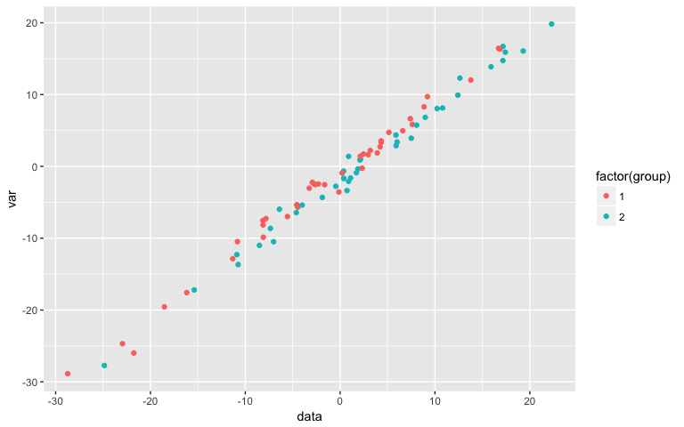

A title for the analysis
========================

I find this type of document perfect for tutorials. I used it to show the commands and output for a [R workshop](https://github.com/jmonlong/HGSS_Rworkshops/blob/master/Advanced-Tidyverse-Bioconductor-2018/HGSS-Rworkshop2018-advanced-liveScript.md).

It's also good to link code to a publication. For example, we created a GitHub repository with the code and outputs of our recent paper (see [epipopsv repo](https://github.com/jmonlong/epipopsv) and the `reports` folder). It shows how each figure/table was produced using R Markdown.

``` r
library(dplyr)
library(knitr)
library(broom)
library(ggplot2)
```

First part
----------

You can write a short description about what this part is about, what you want to achieve, etc. Potentially explain how you got the input data and what it is.

For example, let's say I want to create some fake normal data to later test differences between two groups.

``` r
N = 40
df = tibble(group = rep(1:2, N), var = rnorm(2 * N, 0, 10)) %>% mutate(data = rnorm(n(), 
    group) + var)
df %>% head %>% kable
```

|  group|         var|         data|
|------:|-----------:|------------:|
|      1|  -13.854191|  -14.6870145|
|      2|   -6.939499|   -5.6428160|
|      1|   -9.339964|   -7.4029521|
|      2|   -6.637002|   -5.5026223|
|      1|  -10.736660|   -9.4814768|
|      2|   -2.962756|   -0.3646996|

Second part
-----------

Now we want to test differences between the two groups.

### t-test

``` r
tt.o = t.test(subset(df, group == 1)$data, subset(df, group == 2)$data)
tt.o
```

    ## 
    ##  Welch Two Sample t-test
    ## 
    ## data:  subset(df, group == 1)$data and subset(df, group == 2)$data
    ## t = -1.3331, df = 75.871, p-value = 0.1865
    ## alternative hypothesis: true difference in means is not equal to 0
    ## 95 percent confidence interval:
    ##  -8.035069  1.591765
    ## sample estimates:
    ## mean of x mean of y 
    ## 0.1878545 3.4095063

Not significant, the p-value is 0.1864959.

### Controlling for something

A linear model that controls for the `var` column.

``` r
library(broom)
lm(group ~ data + var, data = df) %>% tidy %>% kable
```

| term        |    estimate|  std.error|  statistic|    p.value|
|:------------|-----------:|----------:|----------:|----------:|
| (Intercept) |   1.2700570|  0.0880197|  14.429240|  0.0000000|
| data        |   0.1578799|  0.0485942|   3.248947|  0.0017180|
| var         |  -0.1527974|  0.0489313|  -3.122694|  0.0025247|

Now it's significant, yeay !

Third part
----------

Maybe it's time for one graph.

``` r
library(ggplot2)
ggplot(df, aes(x = data, y = var, colour = factor(group))) + geom_point()
```


