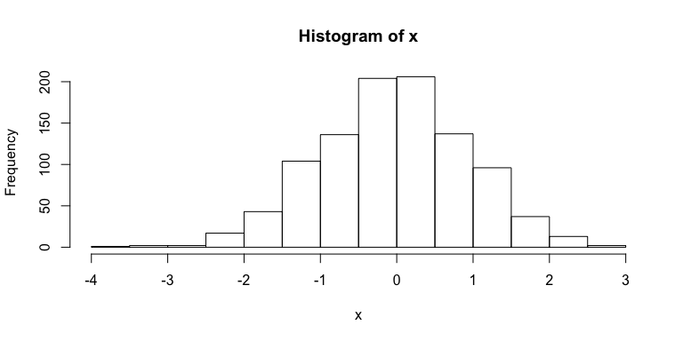

Introduction
============

What is R Markdown ?
--------------------

### Markdown

-   Markdown is a **simple** language to write documents.
-   Markdown **can be converted to many formats**: html, pdf, docx, epub, ...

### R Markdown

-   R Markdown is a way to **embed R code** within a Markdown document.
-   R code can be run and its output part of the final document.


Why use R Markdown ?
--------------------

1.  Easier to document an analysis.
2.  Everything in one place: code, figures, comments.
3.  Encourage better analysis, transparency and reproducibility
4.  Speed up the "analysis-to-report" time.

### Practical cases

1.  Analysis report for you, your PI, or your lab-book/wiki. <sup>*Markdown*</sup>
2.  Report to share with collaborators. <sup>*PDF*</sup> <sup>*HTML*</sup>
3.  Code associated with a paper. <sup>*Markdown*</sup>
4.  Tutorials/workshops. <sup>*Markdown*</sup>
5.  Websites/blogs. <sup>*Markdown*</sup>

How ?
-----

1.  Write a Markdown document with your favorite editor/RStudio.
    -   Header defines metadata and render parameters.
    -   Text using Markdown syntax.
    -   R code chunks that will be run.

2.  Render the document:
    -   In R, run the `render` function from the *rmarkdown* package.
    -   In Rstudio, click on `Knit`

Header
======

YAML Header
-----------

Defines the metadata of the document and parameters for the compilation.

``` yaml
---
title: "Introduction to R Markdown"
subtitle: "MonBUG Meeting"
author: "Jean Monlong"
date: May 9, 2018
output: ioslides_presentation
---
```

Markdown syntax
===============

Text syntax
-----------

``` yaml
# Header 1

## Header 2

### Header 3
```

 

``` yaml
Some text with a **word in bold**, another *in italic* and 
a [link](https://rmarkdown.rstudio.com)
```

Some text with a **word in bold**, another *in italic* and a [link](https://rmarkdown.rstudio.com)

Lists
-----

``` yaml
- Bullet item 1
    1. Ordered item 1
    1. Ordered item 2
- Bullet item 2
- Bullet item 3
```

-   Bullet item 1
    1.  Ordered item 1
    2.  Ordered item 2
-   Bullet item 2
-   Bullet item 3

 

*Note: 4 spaces to define sub-lists.*

R code
======

R Chunk
-------

```` yaml
```{r histtest}
x = rnorm(1000)
hist(x)
```
````

 

Advice: Name your chunks.

-   Used for figure names.
-   Helps debugging.

R Chunk
-------

``` r
x = rnorm(1000)
hist(x)
```



Chunk options
-------------

-   `eval=FALSE`: don't run the code.
-   `echo=FALSE`: don't show the output.
-   `message=FALSE`: don't show the output messages.
-   `warning=FALSE`: don't show the output warnings.
-   `include=FALSE`: don't output anything (but code is run).
-   `fig.width=8`: set the width of figures.
-   `cache=TRUE`: cache the results of a chunk.
-   `tidy=TRUE`: tidy the code.

Specifying default chunk options
--------------------------------

At the beginning of the document. For example "no code" mode:

```` yaml
```{r include=FALSE}
knitr::opts_chunk$set(echo=FALSE, message=FALSE,
                      warning=FALSE, fig.width=10)
```
````

Or "code+output" mode:

```` yaml
```{r include=FALSE}
knitr::opts_chunk$set(echo=TRUE, message=FALSE,
                      warning=FALSE, fig.width=10, tidy=TRUE)
```
````

Cache
-----

```` yaml
```{r cache=TRUE}
res = reallyLongComputation(x)
hist(res)
```
````

 

-   Use with caution. Especially if it depends on other chunks.
-   `dependson` can specify dependency but not very practical.
-   Apparently `autodep` tries to understand dependencies.

-   Caching manually is safer IMO.

Tables
======

`kable` function
----------------

``` r
df
```

    ##            time Rmarkdown.knowledge Rmarkdown.usage
    ## 1 Before MonBUG                3801       0.1123095
    ## 2  After MonBUG               11543       0.2234982

``` r
library(knitr)
kable(df)
```

| time          |  Rmarkdown.knowledge|  Rmarkdown.usage|
|:--------------|--------------------:|----------------:|
| Before MonBUG |                 3801|        0.1123095|
| After MonBUG  |                11543|        0.2234982|

`kable` and its arguments
-------------------------

``` r
kable(df, digits = 2, format.args = list(big.mark = ","), 
    col.names = c("Time", "RMarkdown knowledge", 
        "Rmarkdown usage"))
```

| Time          |  RMarkdown knowledge|  Rmarkdown usage|
|:--------------|--------------------:|----------------:|
| Before MonBUG |                3,801|             0.11|
| After MonBUG  |               11,543|             0.22|

Resize wide tables for Beamer slides
------------------------------------

```` yaml
```{r, include=FALSE}
knitr::knit_hooks$set(resize = function(before, options, envir) {
    if (before) {
      return('\\resizebox{\\textwidth}{!}{')
    } else {
      return('}')
    }
})
```

## Wide table

```{r, resize=TRUE}
knitr::kable(df, format='latex')
```
````

Output formats
==============

Markdown
--------

``` yaml
---
output: md_document
---
```

 

For GitHub/Bitbucket pages or wikis.

``` yaml
---
output:
  md_document:
    variant: markdown_github
---
```

HTML
----

``` yaml
---
title: "Your title"
output:
  html_document:
    toc: true
---
```

 

Customizable themes and cool features:

-   Table of Contents (`toc`).
-   Floating Table of Contents (`toc_float`).
-   Fold code chunks (`code_folding`).
-   Tabs.

Beamer presentation (PDF)
-------------------------

``` yaml
---
title: "Introduction to R Markdown"
subtitle: "MonBUG Meeting"
author: "Jean Monlong"
date: May 9, 2018
output: beamer_presentation
---
```

 

Trick: use PNG image types to reduce PDF size (sometimes).

``` yaml
output:
  beamer_presentation:
    dev: png
```

Beamer presentation (PDF)
-------------------------

Remove navigation bar and add page numbers

``` yaml
---
output:
  beamer_presentation:
    includes:
      in_header: header.tex
---
```

And in `header.tex`:

``` latex
\setbeamertemplate{navigation symbols}{}
\setbeamertemplate{footline}[page number]
```

Sharing documents
-----------------

-   Single files
    -   PDF
    -   HTML have images embedded.
-   On GitHub as Markdown files
    -   `.md` file and `_files` folder (with images).
-   On GitHub as HTML files
    -   Name the file `index.html` and switch on GitHub Pages.
    -   Use [rawgit.com](https://rawgit.com/).
-   On [RPubs](https://rpubs.com/) ("Publish" button in RStudio).

Going further
=============

Documentation
-------------

-   [R Markdown](https://rmarkdown.rstudio.com/)
-   [Chunk options from knitr's website](https://yihui.name/knitr/options/)
-   [R Markdown Cheatsheet](https://www.rstudio.com/wp-content/uploads/2016/03/rmarkdown-cheatsheet-2.0.pdf) (2 pages).
-   [R Markdown Reference Guide](https://www.rstudio.com/wp-content/uploads/2015/03/rmarkdown-reference.pdf) (5 pages).

Going further
-------------

-   Bibliography from `.bib` files.
-   Websites with the [`blogdown` package](https://bookdown.org/yihui/blogdown/).
-   Dashboards, e.g. [flexdashboard](https://rmarkdown.rstudio.com/flexdashboard/index.html)
-   [Interactive notebooks](https://rmarkdown.rstudio.com/r_notebooks.html).
-   Interactive graphs in HTML documents ([example](http://timelyportfolio.github.io/rCharts_nyt_home_price/)).
